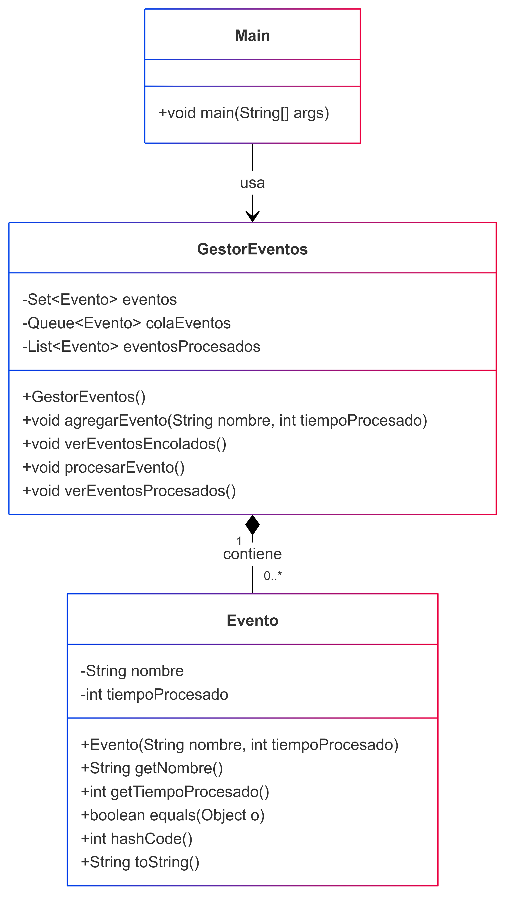

# Gestor de Eventos

Este programa simula un sistema de gestión de eventos donde los eventos se almacenan en una cola y se procesan en orden **FIFO** (First In, First Out). Cada evento es único y se procesa individualmente, actualizando su estado en un conjunto de eventos procesados.

## Cómo Funciona

1. Los eventos se agregan a una cola (**FIFO**).
2. Cada evento se procesa individualmente.
3. Los eventos procesados se almacenan en una lista para su consulta.
4. El sistema permite agregar nuevos eventos, ver los eventos en cola, procesar eventos y ver los eventos ya procesados.

## Estructuras de Datos Utilizadas

- **Set**: Almacena todos los eventos únicos.
- **Queue (Cola FIFO)**: Gestiona los eventos pendientes de procesar.
- **List**: Almacena los eventos ya procesados.

## Descripción de las Clases

### 1. **Event**
   - Representa un evento con un nombre y un tiempo de procesado.
   - Métodos: `getName()`, `getProcessingTime()`, `equals()`, `hashCode()`, `toString()`.

### 2. **EventManager**
   - Gestiona los eventos utilizando un `Set` para eventos únicos, una `Queue` para eventos pendientes y una `List` para eventos procesados.
   - Métodos: `addEvent()`, `viewEnqueuedEvents()`, `processEvent()`, `viewProcessedEvents()`.

### 3. **Main**
   - Punto de entrada del programa.
   - Implementa un menú interactivo para que el usuario pueda gestionar los eventos.

---

## Ejemplo de Uso

### Menú Principal
El programa muestra un menú con las siguientes opciones:

1. **Agregar evento**:
   - Solicita el nombre del evento y el tiempo de procesado.
   - Ejemplo:
     ```
     Nuevo evento: evento1
     Tiempo de procesado (ms): 200
     ```

2. **Ver eventos encolados**:
   - Muestra los eventos que están en la cola esperando ser procesados.
   - Ejemplo:
     ```
     Eventos encolados:
     {evento1, 200ms}
     {evento2, 100ms}
     ```

3. **Procesar evento**:
   - Extrae y procesa el primer evento de la cola.
   - Ejemplo:
     ```
     Procesando: evento1
     Tiempo: 200ms
     ```

4. **Ver eventos procesados**:
   - Muestra los eventos que ya han sido procesados.
   - Ejemplo:
     ```
     Eventos procesados:
     {evento1, 200ms}
     ```

5. **Salir**:
   - Termina la ejecución del programa.

---

## Parámetros de Simulación

- Los eventos se procesan en el orden en que fueron agregados (**FIFO**).
- Cada evento tiene un tiempo de procesado definido por el usuario.

---

## Ejemplo de Entrada

```java
1
Nuevo evento: evento1
Tiempo de procesado (ms): 200
1
Nuevo evento: evento2
Tiempo de procesado (ms): 100
2
3
4
5
```

# Salida Esperada
```java
Evento 'evento1' agregado con un tiempo de procesado de 200ms.
Evento 'evento2' agregado con un tiempo de procesado de 100ms.

Eventos encolados:
{evento1, 200ms}
{evento2, 100ms}

Procesando: evento1
Tiempo: 200ms

Eventos procesados:
{evento1, 200ms}

Saliendo...
```

### Diagrama de Clases
 